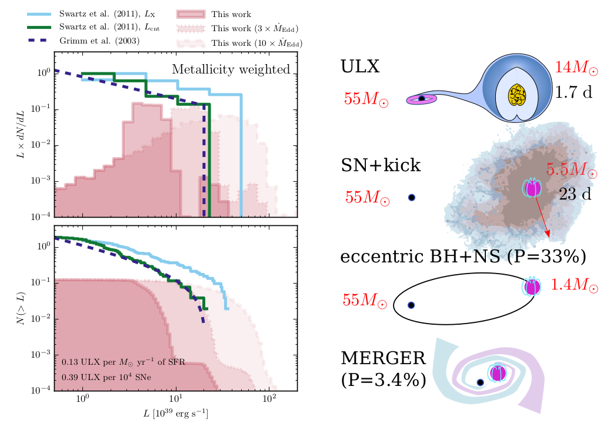

# 2016 ULX

**MESA version: 8845**
but you are welcome to try/adjust these files for future versions.

To easily download these files, simply use
```
svn export https://github.com/orlox/mesa_input_data/trunk/2016_ULX 2016_ULX
```

Input data to reproduce results in Marchant et al. (2016), to be submitted.

Throughout this README, it is assumed that the user already has MESA properly installed,
if not, follow in detail the instructions given in the [MESA website](http://mesa.sourceforge.net/prereqs.html).



## template
This folder contains a template which was used to model systems at all metallicities.
Masses and initial orbital periods are specified in the *inlist_extra* file,
```
&binary_controls
m1 = 70.7945784384d0
m2 = 14.1589156877d0
initial_period_in_days = 1.100d0
/ ! end of binary_controls namelist

```
and the composition is specified in the inlist_extra_sj file,
```
&star_job
relax_initial_Z = .true.
new_Z = 0.000316227766d0
relax_initial_Y = .true.
new_Y = 0.248300832755d0
/ ! end of star_job namelist

&controls
Zbase = 0.000316227766d0
/ ! end of controls namelist


```
which corresponds to the ULX model with q=0.2 from the paper discussed in section 3.

To run any of these models, cd into the corresponding directory, adjust inlist_extra,
and inlist_extra_sj, compile and run
```
./clean && ./mk
./rn
```

## data
This folder contains compressed data files. This includes summary tables with the outcomes of evolution for
each of the ~120000 models, and properties of the binary models during phases of mass transfer from the
secondary to a BH. The file summary_tables.tar.gz contains one file per metallicity specifying  the outcome of each
simulation. The content is described in the header of each file, which reads

```
#Data from case M models
#Possible outcomes are contained in the 'result' column and are:
#    -ZAMS_L2_overflow: Contact at ZAMS would be deep enough to reach L2. Should merge.
#    -ZAMS_RLOF: System overflows its Roche lobe at ZAMS.
#    -L2_overflow: Stars undergo deep contact reaching L2. Should merge.
#    -off_CHE: Rotational mixing is not efficient enough and the primary does not evolve chemichally homogeneous.
#    -MT_P->S: Primary overflowed its Roche lobe.
#    -MT_S->P_PoffMS: Primary evolved chemically homogeneously, became a WR star, but the secondary.
#                     overflowed its Roche lobe before helium depletion of the primary.
#    -MT_S->P_PonMS: Primary evolved chemically homogeneously, but the secondary.
#                     overflowed its Roche lobe while the primary was still on the MS.
#    -MT_to_pm_caseA, MT_to_pm_caseB: Primary evolves chemically homogeneous and forms a BH
#                     (pm stands for point mass), and then the secondary expanded and
#                     initiated Roche lobe overflow. A '_D', '_C' or '_E' is appended
#                     depending on the reason for termination. '_D' means that during case BB
#                     mass transfer reached hydrogen depleted layers. '_C' means that the secondary
#                     depleted helium, while '_E' means there where convergence issues.
#    -noMT_to_pm: System should form double BHs, both stars evolve chemically homogeneously
#                     and deplete helium outside 60-130 Msun PISN range).
#    -PISN: One star in the system depletes helium inside the PISN range (60-130 Msun).
#    -convergence_error: Run did not complete due to convergence issues.
#    -missing_data: For misterious reasons the data for this model is missing/incomplete.
#For all systems, if the primary evolved chemically homogeneous and formed a BH, this table provides
#masses periods, masses and bh spin (M_1bh, M_2bh, P_bh and bh_spin). Quantities with '_f' indicate values
#at the last timestep of the simulation. The darwin_unstable column is one if the system would be affected
#by the darwin instability at ZAMS (a<sqrt(3*(I_1+I_2)/mu)), and zero otherwise.
   log10(M_1i)(Msun)   qratio(M_2i/M_1i)           P_i(days)         metallicity              result          M_1f(Msun)          M_2f(Msun)           P_f(days)         M_1bh(Msun)         M_2bh(Msun)          P_bh(days)             bh_spin     darwin_unstable
```
Each of the mt_data files contains a single ascii file with all the data from mass transfer
at that metallicity. All of this is past the point where the primary has formed a BH and
there is one line per timestep. The data included is
```
#Data during MT phases
             age(yr)   log10(M_1i)(Msun)   qratio(M_2i/M_1i)           P_i(days)              weight               caseA           M_1(Msun)           M_2(Msun)         delta_t(yr)         lg_mdot_edd      mtransfer_rate      lg_acc_L(Lsun)             bh_spin        surface_h1_d       surface_he4_d
```
The meaning of each field is as follows:
- age(yr): Age in years of the system, counting from the ZAMS
- log10(M_1i)(Msun), qratio(M_2i/M_1i), P_i(days): Initial properties
- weight: Normalized weight of this system, assuming a Salpeter mass function,
a period distribution that is flat in logP, and a flat distribution in q.
In loose notation:
```
weight=d(log M_1)*d(log P)*dq*f_{log M}(log M)*f_{log P}(log P)*f_q(q)
           /int(f_{log M}(log M),8 Msun, inf)
           /int(f_{log P}(log P),0.5 days, 1 year)
           /int(f_{q}(q),0,1)
```
the IMF is considered for stars above 8 Msun, as we normalize all our results using
SNe rates.
- caseA: equal to 1 if the donor is in the main sequence, 0 otherwise. This and all
the other columns refer to values particular to a timestep.
- M_1(Msun), M_2(Msun): BH and donor mass respectively.
- delta_t(yr): Size of the timestep in years.
- lg_mdot_edd: Eddington accretion rate for the BH in units of Msun/yr.
- mtransfer_rate: Mass transfer rate in Msun/yr. Accretion is limited to lg_mdot_edd.
- lg_acc_L(Lsun): Luminosity from accretion when limited to mdot_edd.
- bh_spin: Spin parameter of the BH.
- surface_h1_d, surface_he4_d: Surface hydrogen and helium mass fraction for the donor.

## scripts
These are mainly plotting tools and also scripts used to compute certain results. No
support provided for these, their here only for my convenience.
